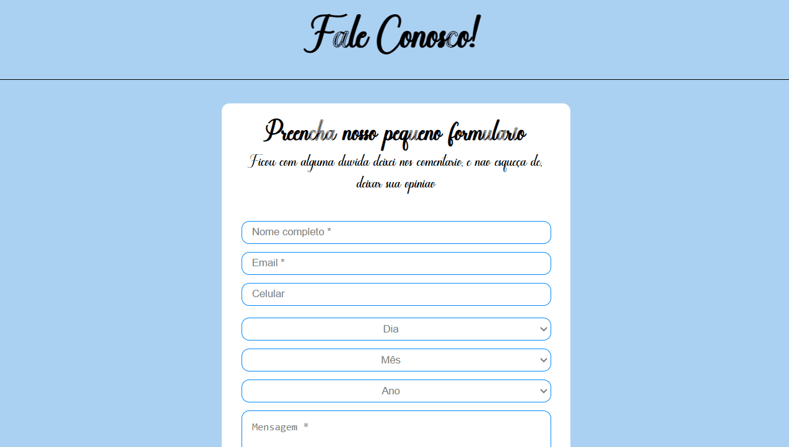

# Projeto ravi
[]

## Tecnologias utilizadas 
- HTML
- CSS
- JS
  
## Como utilizar?
Projeto ravi é um site onde você consegue interagir.

Ele é dividido em 3 partes
- curisidades
- fotos
- fale conosco
- 
 ## Curiosidades
 []

## Fotos
[]

## Fale conosco
[]

 ## O que motivou a fazer esse projeto?
  Projeto ravi foi um dos meus primeiros projetos a serem feitos , tudo o que eu aprendia colocava nele, meu filho foi a grande inspiração a fazer esse site.
  
## Dificuldades encontradas

 Principais dificuldades foram na parte resposiva do site, para que se adapta-se a todas dimensões e parte do js que foi com laços de repetições.

 ## Versão mobile
 []
 
## Link
(https://igorsousasilva.github.io/Ravi/)
 
